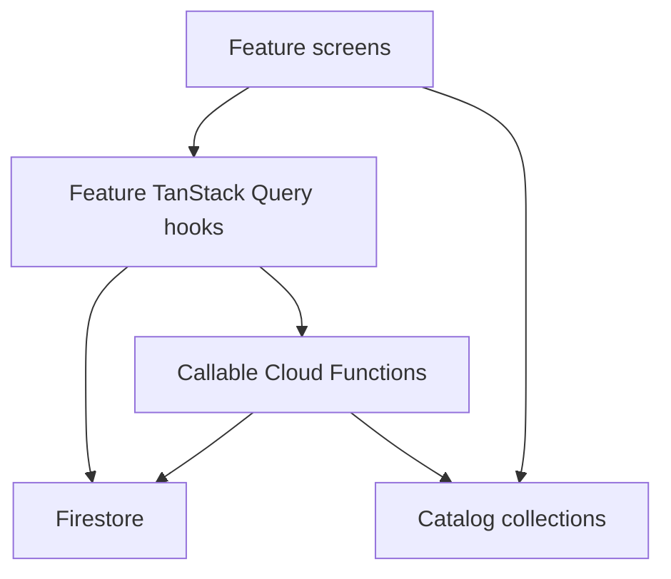

# Vikings War — Full Game Implementation

Create the React Native CLI app in this folder (keeping existing `.cursor/` and `plans/`), then implement all 23 roadmap phases as working game systems. Phases 19–22 are launch operations, not store submissions: those phases ship as environments, feature flags, analytics, alpha allowlists, and store-listing docs. Content is **data-driven seed data** (enough to play every loop), not hundreds of live quests.

## Locked design (Phase 0 GDD)

Write [docs/GAME_DESIGN.md](docs/GAME_DESIGN.md) with these decisions:

- **Title:** Vikings War
- **Setting:** Norse coastal jarldoms, raids, clans, mythology
- **Audience:** Casual/mid-core mobile RPG, short sessions (3–10 min)
- **Loop:** login → collect village resources → quests/raids → XP/silver/loot → upgrade Viking/warriors/village → PvP/territories → repeat
- **PvP:** Asynchronous raids after PvE is playable
- **Monetization:** Convenience, cosmetics, passes — not guaranteed victory
- **Art:** Dark Nordic UI (charcoal, iron, gold, rune accents)
- **Platforms:** iOS + Android
- **Stack:** React Native CLI + TypeScript + React Navigation + TanStack Query + React Native Firebase + Cloud Functions

## Project bootstrap

The workspace is not empty. Initialize in a temp directory, then move files into the repo root without overwriting `.cursor/` or `plans/`.

```bash
npx @react-native-community/cli@latest init VikingsWar \
  --package-name com.atomicdevs.vikingswar \
  --skip-git-init \
  --directory /tmp/VikingsWar
```

Then:

- Set display name to **Vikings War** (`ios/.../Info.plist` `CFBundleDisplayName`, `android/.../strings.xml`)
- Confirm iOS bundle ID and Android `applicationId` / namespace are `com.atomicdevs.vikingswar`
- Point the app entry at `src/app/App.tsx`
- Add path alias `@/` → `src/`
- Add Jest + React Native Testing Library; colocate `*.test.ts(x)` with features

**App dependencies:** `@react-navigation/native` + native-stack + bottom-tabs, `@tanstack/react-query`, `@react-native-firebase/{app,auth,firestore,functions,storage}`, `react-native-screens`, `react-native-safe-area-context`, `react-native-gesture-handler`. Messaging, Analytics, Crashlytics, and `react-native-iap` are wired but **no-op or mocked in emulator/dev** so the app runs without a real Firebase/Google/Apple project.

## Architecture

Server-authoritative rule from the roadmap: the client never decides silver, combat, XP, loot, building completion, or PvP results. The client reads Firestore and calls Cloud Functions.



```text
/
├── android/ ios/                 # RN CLI native projects
├── src/
│   ├── app/                      # App.tsx, navigation, providers
│   ├── features/                 # one folder per domain
│   ├── components/ui/            # shared Nordic UI kit
│   ├── lib/                      # firebase, query, iap, analytics
│   └── types/
├── functions/                    # Cloud Functions (TypeScript)
├── shared/                       # types + catalog IDs only (no combat math)
├── firebase/                     # rules, indexes, emulator seed
├── docs/                         # GDD, store listing, live-ops
└── firebase.json
```

**Firebase emulator-first**

- `firebase.json` emulators: Auth, Firestore, Functions, Storage (and optionally Pub/Sub)
- Placeholder `google-services.json` and `GoogleService-Info.plist` so native Firebase can compile
- `src/lib/firebase/initFirebase.ts` calls `useEmulator()` in `__DEV__` (`10.0.2.2` on Android emulator, `localhost` on iOS)
- Firestore rules: clients **read** own player data + public catalogs; progression **writes** only via Admin SDK in Functions
- Seed script loads catalogs + a demo player into the emulator

**Shared vs server-only:** `shared/` holds TypeScript interfaces and catalog IDs. Combat, loot rolls, regen, XP, and economy math live only in `functions/src/game/`.

**Auth / session:** Email + password (emulator). `useAuth` wraps RN Firebase Auth. After first login, a callable `createViking` creates the player doc.

**Navigation hub**

- Auth stack: sign in / register / create Viking
- Main tabs: Village, Quests, Battle, Clan, Profile
- Stacks: inventory, warband, world map, events, shop, friends, leaderboards, village visitor, boss raid

## Backend catalogs (data-driven)

Seed Firestore collections (not hardcoded in React Native):

- `catalogs/quests`, `enemies`, `items`, `lootTables`, `buildings`, `warriors`, `territories`, `bosses`, `collections`, `events`, `achievements`, `shopProducts`, `xpCurve`, `dailyLogin`

Player documents under `players/{uid}` include stats, currencies, energy/stamina timestamps, equipment loadout, PvP protection, and progression flags.

## Phase mapping (all implemented)

### Milestone 1 — Foundation (Phases 0–1)

- GDD + RN app + QueryClient + navigation shell + Firebase emulator + Auth + Crash/Analytics stubs + FCM permission stub
- Player bootstrap callable and security rules
- Nordic UI primitives: `Screen`, `Button`, `StatBar`, `ResourceBar`, `Card`

### Milestone 2 — Core RPG (Phases 2–3)

- Viking identity: name, avatar, level, XP, health/attack/defense, silver/food/wood/iron/runes
- XP curve + level-up rewards (server)
- Energy (max 100, +1 / 5 min) and stamina (max 20, +1 / 15 min) stored as `{ current, max, lastUpdatedAt }` and regenerated from elapsed time on the server — never a ticking DB writer
- Daily login callable

### Milestone 3 — Gameplay (Phases 4–5)

- Quest engine: chapters 1–5, categories (hunting, gathering, raiding, exploration, trading, warfare, mythology, boss), requirements, energy cost
- `completeQuest` spends energy, rolls rewards/loot server-side, returns a result DTO
- PvE combat callable: base damage + weapon + warrior + variance + crit; formula only on server; result screen on client

### Milestone 4 — RPG depth (Phases 6–7)

- Slots: weapon, helmet, armor, shield, boots, ring, amulet
- Rarities: common → mythic; weapons: axe, sword, spear, bow, dane axe, seax
- Inventory + equip callables; loot tables from quests/combat
- Warband: recruit/upgrade warriors (Berserker, Shieldmaiden, Archer, Raider) with class, rarity, stats, cap (e.g. 8/20)

### Milestone 5 — Village + economy (Phases 8–9)

- Buildings: Great Hall, Farm, Lumber Camp, Iron Mine, Blacksmith, Barracks, Shipyard, Trading Post, Temple
- `collectResources` and `upgradeBuilding` (wood/iron/silver + duration; completion timestamp authoritative)
- Resource rates from building levels; storage caps; Runes as premium currency with a non-P2W spend list (speed-ups, extras, cosmetics — not raw combat power)

### Milestone 6–7 — Social + PvP (Phases 10–11, 16)

- Async PvP raid callable: level matchmaking, daily attack limits, cooldown, protection window, revenge flag, battle history
- Clans: name, banner, level, members, treasury, clan quests, upgrades, clan leaderboard
- Clan chat via Firestore with tight rules
- Friends, gifts, player profiles, visit village (read-only), help clan member, achievements, global/clan/PvP leaderboards

### Milestone 8 — World (Phases 12–13)

- Territory map: Village → Coastal Lands → Northern Forest → Frozen Mountains → Enemy Kingdom → Legendary Lands
- Explore/raid/conquer callables gated by level and quest chapter
- Solo bosses + clan raid (shared HP, damage attribution, reward on kill) — e.g. Enemy Jarl, Frost Giant, Sea Serpent

### Milestone 9 — Retention (Phases 14–15, 18)

- Collection sets (relics, weapons, ships, trophies) with completion bonuses applied in server stat calc
- Event framework: `events/{id}` config (start/end, currency, rewards) so Ragnarok / Raid Week / Festival / World Boss can be turned on without an app release
- Analytics event catalog (DAU proxies, quest complete, PvP, level-up, spend/earn, session) written through `src/lib/analytics` (emulator logs; real Firebase Analytics when config is swapped)
- Remote live-ops doc `config/liveOps` for feature flags and numeric tunables

### Milestone 10 — Monetization (Phase 17)

- Shop UI: rune packs, cosmetics, village decorations, battle/event pass
- `src/lib/iap`: real `react-native-iap` behind an interface; `__DEV__` / emulator uses `DevIapAdapter` → callable `fulfillDevPurchase`
- Server grants items; client never adds Runes locally
- Philosophy encoded in product catalog flags (`powerAffecting: false` for cosmetics)

### Milestone 11–12 — Testing and launch readiness (Phases 19–23)

Not an actual App Store/Play launch. Implement:

- **Alpha:** `config/allowlist` gate + `docs/alpha-test-checklist.md`
- **Beta:** env flavors (`development` / `alpha` / `beta` / `production`) via a small `src/lib/env.ts`
- **Soft launch / global launch:** `docs/store/listing.md` (copy, keywords, privacy notes), version/build placeholders, release script notes from the release skill
- **Post-launch:** content pipeline documented in `docs/live-ops.md` (add catalog docs in Firestore, no app binary). Seed includes one extra “Season 1” quest/item to prove the pipeline

## Seed content (playable, not exhaustive)

- 5 story chapters, 3–4 quests each
- ~15 items, 6 enemies, 3 bosses, 8 buildings, 4 warrior classes, 5 territories, 2 collection sets, 1 timed event, shop products, daily login table

## Testing (required per project rules)

Unit-test **server/pure logic** (no RN render) for:

- Energy/stamina regen from timestamps
- XP / level-up
- Combat damage
- Loot table rolls (seeded RNG)
- Building completion / resource accrual
- PvP eligibility (level band, protection, daily cap)

Plus hook/component tests for auth gate, quest list loading/error, and combat result display. Functions tests run against the emulator or extracted pure modules.

After significant work: `npx tsc --noEmit` and the Jest suite.

## What will not be done in this build

- Submitting to App Store / Google Play or inviting 50–5,000 real testers
- A production Firebase project (you will replace placeholder plist/json later)
- Real IAP receipt validation against Apple/Google (interface + emulator fulfillment only)
- Custom native modules beyond Firebase / IAP / permissions
